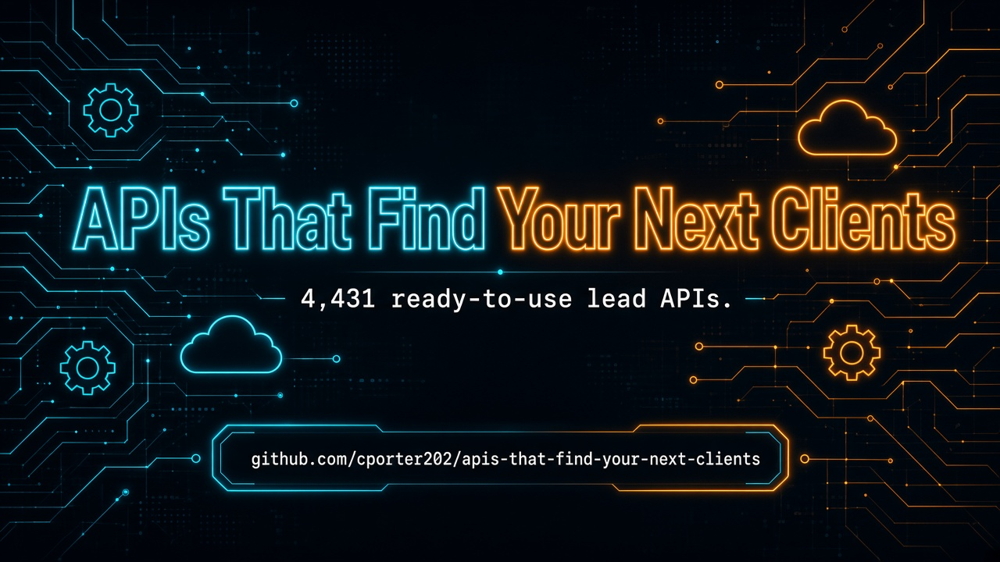

 
 

  <a href="#at-a-glance"><strong>At A Glance</strong></a>
  |
  <a href="#start-here"><strong>Start Here</strong></a>
  |
  <a href="#explore-the-stack"><strong>Explore The Stack</strong></a>
  |
  <a href="#why-this-repo-wins"><strong>Why This Repo Wins</strong></a>
  |
  <a href="#star-history"><strong>Star History</strong></a>

### 🚀 Join My Skool Community

**Want to learn how to vibe code like the pros? Join my Skool community! 🎯**

*I'll show you how to set up applications to use these APIs and start making money! I have the best tech stack when it comes to vibe coding that virtually costs nothing. Forget tools like Loveable, Replit, Manus, Base44, etc.*

 

  <a href="https://www.skool.com/vibe-coding-with-chris-7196" target="_blank" style="display: inline-block; background: #667eea; background-image: linear-gradient(135deg, #667eea 0%, #764ba2 100%); color: #ffffff !important; text-decoration: none !important; padding: 18px 45px; font-size: 18px; font-weight: bold; border-radius: 35px; box-shadow: 0 8px 25px rgba(102, 126, 234, 0.5); letter-spacing: 1px; text-transform: uppercase; border: 2px solid rgba(255, 255, 255, 0.3); cursor: pointer; font-family: -apple-system, BlinkMacSystemFont, 'Segoe UI', Helvetica, Arial, sans-serif;">
    🚀 Join Vibe Coding Community →
  </a>

## At A Glance

> The ultimate collection of lead-finding APIs — production-ready tools for filling your pipeline, from contact enrichment to B2B prospecting. **4,431 production-ready APIs** across **6 navigable sections**.

This repository is designed to feel like a launchpad, not a junk drawer. Pick a section folder, scan the API table, and click through to the provider — no endless flat scrolling.

| Metric | Count |
|--------|-------|
| Total APIs | 4,431 |
| Categories | 6 |
| Last Updated | 2026-09-16 |
| Focus | Lead Generation |

<table>
  <tr>
    <td width="33%" valign="top">
      <h3>Email & Contact Finders</h3>
      
<strong>1,093 APIs</strong>

      
Find, validate, and enrich emails and contact details at scale.

      
<a href="./email-contact-finders/"><strong>Open Email & Contact Finders Directory</strong></a>

    </td>
    <td width="33%" valign="top">
      <h3>LinkedIn & B2B Prospecting</h3>
      
<strong>691 APIs</strong>

      
LinkedIn scrapers, profile enrichment, and B2B decision-maker prospecting.

      
<a href="./linkedin-b2b-prospecting/"><strong>Open LinkedIn & B2B Prospecting Directory</strong></a>

    </td>
    <td width="33%" valign="top">
      <h3>Company & Firmographic Data</h3>
      
<strong>430 APIs</strong>

      
Company registries, firmographics, tech stacks, and business intelligence.

      
<a href="./company-firmographic-data/"><strong>Open Company & Firmographic Data Directory</strong></a>

    </td>
  </tr>
  <tr>
    <td width="33%" valign="top">
      <h3>Local & Maps Leads</h3>
      
<strong>352 APIs</strong>

      
Google Maps, local business directories, real estate agents, and geo leads.

      
<a href="./local-maps-leads/"><strong>Open Local & Maps Leads Directory</strong></a>

    </td>
    <td width="33%" valign="top">
      <h3>Phone Enrichment & Validation</h3>
      
<strong>72 APIs</strong>

      
Phone number finders, validators, and dialer-ready enrichment.

      
<a href="./phone-enrichment-validation/"><strong>Open Phone Enrichment & Validation Directory</strong></a>

    </td>
    <td width="33%" valign="top">
      <h3>Other Lead Tools</h3>
      
<strong>1,793 APIs</strong>

      
Everything else that still fuels lead gen — niche verticals, legal, marketplaces, and more.

      
<a href="./other-lead-tools/"><strong>Open Other Lead Tools Directory</strong></a>

    </td>
  </tr>
</table>

## Start Here

1. Pick the section you need first from the cards above.
2. Open that folder's README and scan the API names and descriptions.
3. Click through to the provider page for implementation details, pricing, and docs.
4. Build your shortlist fast instead of wasting hours digging through a flat list.

## Explore The Stack

<strong>Email & Contact Finders</strong> (1,093)

Find, validate, and enrich emails and contact details at scale.

- email finders and validators
- contact enrichment
- deliverability checks
- bulk list cleaning

[Browse Email & Contact Finders APIs](./email-contact-finders/)

<strong>LinkedIn & B2B Prospecting</strong> (691)

LinkedIn scrapers, profile enrichment, and B2B decision-maker prospecting.

- LinkedIn profiles and posts
- B2B prospecting
- decision-maker lists
- sales outreach data

[Browse LinkedIn & B2B Prospecting APIs](./linkedin-b2b-prospecting/)

<strong>Company & Firmographic Data</strong> (430)

Company registries, firmographics, tech stacks, and business intelligence.

- company registries
- firmographics
- tech stack intel
- business directories

[Browse Company & Firmographic Data APIs](./company-firmographic-data/)

<strong>Local & Maps Leads</strong> (352)

Google Maps, local business directories, real estate agents, and geo leads.

- Google Maps / local businesses
- real estate agent leads
- directory scrapers
- geo-targeted prospecting

[Browse Local & Maps Leads APIs](./local-maps-leads/)

<strong>Phone Enrichment & Validation</strong> (72)

Phone number finders, validators, and dialer-ready enrichment.

- phone validators
- E.164 enrichment
- bulk phone cleaning
- carrier / line-type checks

[Browse Phone Enrichment & Validation APIs](./phone-enrichment-validation/)

<strong>Other Lead Tools</strong> (1,793)

Everything else that still fuels lead gen — niche verticals, legal, marketplaces, and more.

- niche vertical leads
- marketplace sellers
- legal / compliance leads
- misc enrichment tools

[Browse Other Lead Tools APIs](./other-lead-tools/)

## Built For

<table>
  <tr>
    <td width="25%" align="center"><strong>Sales Teams</strong></td>
    <td width="25%" align="center"><strong>Agencies</strong></td>
    <td width="25%" align="center"><strong>SaaS Founders</strong></td>
    <td width="25%" align="center"><strong>Recruiters</strong></td>
  </tr>
  <tr>
    <td width="25%" align="center"><strong>B2B Outbound</strong></td>
    <td width="25%" align="center"><strong>CRM Enrichment</strong></td>
    <td width="25%" align="center"><strong>Local Lead Gen</strong></td>
    <td width="25%" align="center"><strong>Growth Hackers</strong></td>
  </tr>
</table>

## Why This Repo Wins

- It is opinionated. Sections map to how builders actually search for APIs.
- It is navigable. Top-level folders beat one giant markdown table every time.
- It is faster to use. Jump straight to the category that matches your use case.
- It keeps affiliate tracking intact (`?fpr=p2hrc6`) on every link.
- Custom SVG hero — no blurry PNG banner.

## Scope Guarantee

This repository intentionally organizes APIs into:

**Email & Contact Finders**, **LinkedIn & B2B Prospecting**, **Company & Firmographic Data**, **Local & Maps Leads**, **Phone Enrichment & Validation**, **Other Lead Tools**

Unmatched rows land in the `other-*` catch-all so **zero APIs are dropped**.

## Follow the Creator

See [FOLLOW_CREATOR.md](./FOLLOW_CREATOR.md) — follow Chris Porter on Facebook for more valuable repos and updates.

## Star History

## Maintenance Notes

- Section classification is keyword-based on API name + description.
- Every original table row is preserved exactly, including affiliate params.
- Visual launchpad layout matches the style of [agentic-ai-apis](https://github.com/cporter202/agentic-ai-apis).
